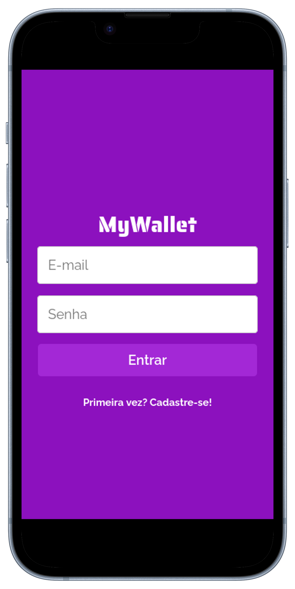
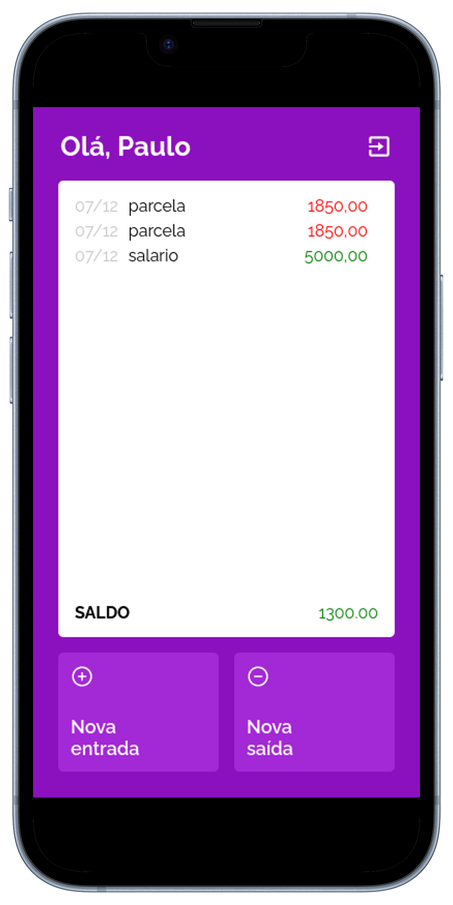
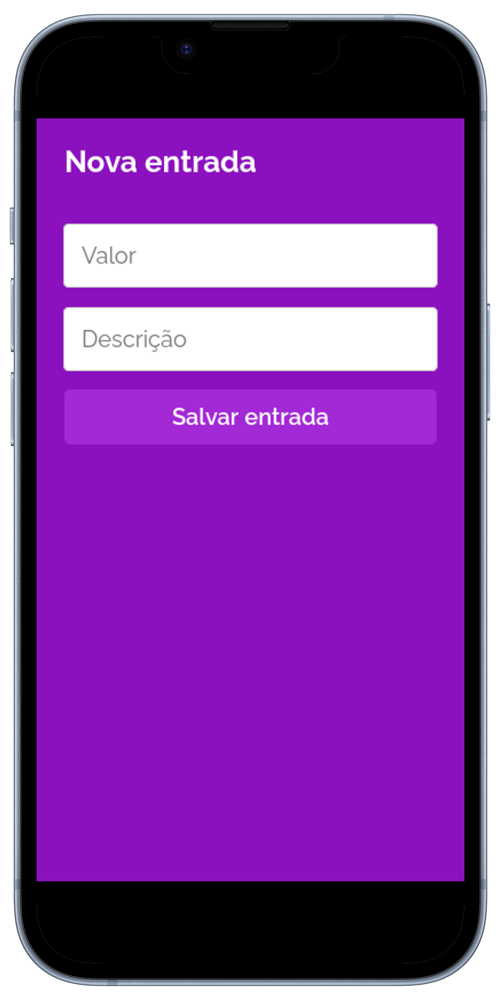

# My Wallet
Aplicação Web front-end desenvolvida durante a formação do BootCamp da Driven. Nesta aplicação, é possível criar usuários, gerenciar finanças através da criação de entradas e saídas, verificar o saldo e as datas de cada transação.


<div align="center">
    
    
    
</div>

# Demo
[Link do deploy](https://projeto14-mywallet-front-fsacerdote.vercel.app/)

# Como funciona?
Assim que abrir a tela inicial você será recebido com uma tela de login, se for sua primeira vez utlizando a aplicação clique em `Primeira vez? Cadastre-se!` para realizar seu cadastro. Em seguida, realize o login com seu email e senha. Na tela principal é possível ver suas transações, saldo e realizar logout através do ícone no canto superior direito. Para inserir novas entradas ou saídas clique nos respectivos botões de `Nova entrada` e `Nova saída` e preencha o formulário com o valor e descrição da transação.

# Tecnologias utilizadas
Para este projeto, foram utilizadas:

- React;
- React-icons;
- Styled Components;
- React Router;
- Axios;

# Como rodar em desenvolvimento
Para executar este projeto em desenvolvimento, é necessário seguir os passos abaixo:

- Clonar o repositório;
- Baixar as dependências necessárias com o comando: `npm install`;
- Em seguida, criar o arquivo `.env` com base no `.env.example`;
- Este arquivo `.env` é composto pelas seguintes propriedades:
```
  VITE_API_URL= // insira aqui a url do back-end da aplicação
```
- A propriedade `VITE_API_URL` é a url base para as requisições do back-end;
- O repositório do back-end pode ser acessado [aqui](https://github.com/FSacerdote/MyWallet-Back);
- Por fim, para executar o projeto em desenvolvimento basta executar o comando `npm run dev`;